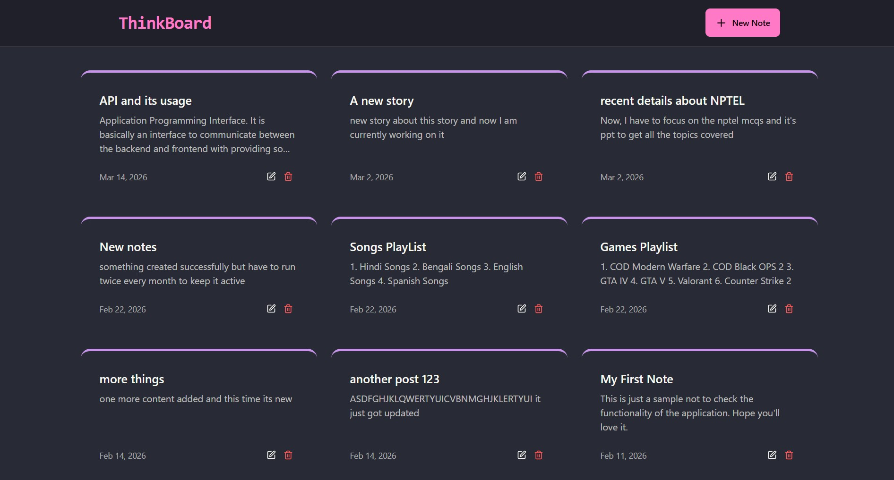

# 🧠 ThinkBoard – Notes App

A modern and responsive **Notes Management Web Application** built using the **MERN Stack (MongoDB, Express.js, React.js, Node.js)**.

ThinkBoard allows users to create, edit, and manage notes efficiently with a clean and minimal UI.

---

## 🚀 Features

* 📝 Create, edit, and delete notes
* 📅 Automatic date tracking
* 🎨 Beautiful card-based UI
* ⚡ Fast and responsive performance
* 🔄 Full CRUD functionality
* 📱 Mobile-friendly design
* 🌙 Dark-themed interface

---

## 🖼️ UI Preview



---

## 🛠️ Tech Stack

### Frontend

* React.js
* CSS / Tailwind CSS
* Axios

### Backend

* Node.js
* Express.js

### Database

* MongoDB (Mongoose)

---

## ⚙️ Installation & Setup

### 1. Clone the Repository

```
git clone https://github.com/your-username/thinkboard.git
cd thinkboard
```

---

### 2. Backend Setup

```
cd server
npm install
```

Create a `.env` file:

```
MONGO_URI=your_mongodb_connection_string
PORT=5000
```

Run backend:

```
npm start
```

---

### 3. Frontend Setup

```
cd client
npm install
npm start
```
---

## 👨‍💻 Author

Ranajoy Dutta
